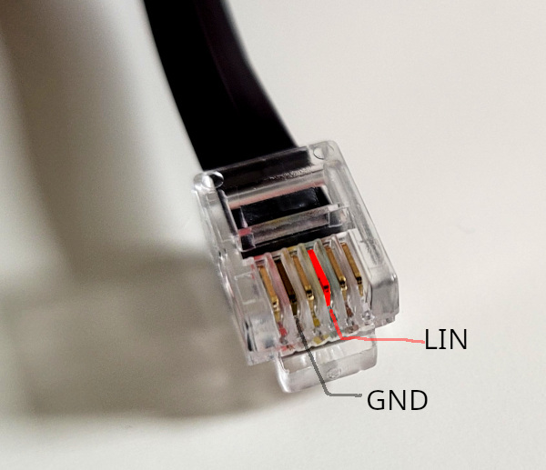

# inetbox.py

This is a software implementation of a Truma iNet box, a device for controlling mobile heater and AC units by Truma and Alde.

This software is not provided, endorsed, supported, or sponsored by Truma or Alde. It may or may not be working with their products. Please read the [license](./LICENSE) file, in particular:

IN NO EVENT UNLESS REQUIRED BY APPLICABLE LAW OR AGREED TO IN WRITING
WILL ANY COPYRIGHT HOLDER, OR ANY OTHER PARTY WHO MODIFIES AND/OR CONVEYS
THE PROGRAM AS PERMITTED ABOVE, BE LIABLE TO YOU FOR DAMAGES, INCLUDING ANY
GENERAL, SPECIAL, INCIDENTAL OR CONSEQUENTIAL DAMAGES ARISING OUT OF THE
USE OR INABILITY TO USE THE PROGRAM.

That said, it is working for me, and I hope it will work for you, too.

## Hardware Requirements

This has been tested with a Truma Combi 4 and the CP Plus control panel (inet ready). I don't see why this wouldn't be working with the Combi 6 and E models as well.

The software runs on a Raspberry Pi, any newer model should do. This could also be ported to a Pi Pico Microcontroller, but I haven't done that yet.

You need a [LIN to UART Transceiver](https://amzn.to/3E1qITr) (Affiliate Link!) for connecting the Raspberry Pi to the LIN bus. On the transceiver module, the connections are as follows:

 * **GND** (any of the two) connects to a ground connection - e.g. on the power supply.
 * **12V** connects to a 12V power supply that also powers the Combi and CP Plus.
 * **TX** connects to pin 15 on the Raspberry Pi.
 * **RX** connects to pin 14 on the Raspberry Pi (14/15 might be the other way round, not sure).
 * **LIN** connects to an RJ12 connector (alias 6P6C, the one with 6 pins) going into any port on the Truma Combi heating, or using a [splitter module](https://amzn.to/3dL4bzT) (Affiliate Link!) into the existing connection between Combi and the control panel. Use standard RJ12 cables for the connection. The relevant pin is highlighted in this picture: 



The other pins (**INH**, **SLP**, second **GND**) are not used.

## Installation

You first need to **enable UART** on the Pi. For this, follow the steps listed under "Configure UART on Raspberry Pi" on [this website](https://www.electronicwings.com/raspberry-pi/raspberry-pi-uart-communication-using-python-and-c#header2) until the step to reboot the Pi.

Then install the software:

 * If `pip3` is not installed, run `sudo apt install python3-pip` first.
 * Then run `pip3 install inetbox_py[truma_service]` if you want to install everything.
 * Alternatively, run `pip3 install inetbox_py` to just install the library in case you want to develop your own code using it. 


**After you have tested that the software works for you**, to install a system service using this software, run **as root**:

```bash
pip3 install inetbox_py[truma_service]
truma_service --install
systemctl enable miqro_truma
systemctl start miqro_truma
```

## Using the MQTT Service

In the following, the MQTT service will be explained. You need an MQTT broker running (e.g. [Mosquitto](https://mosquitto.org/)) for this to work and you should be familiar with basic MQTT concepts.

### Configuration

Define the MQTT broker by creating the file `/etc/miqro.yml` with the broker settings as follows (adapt as needed):

```yaml
broker:
  host: localhost
  port: 1883
  keepalive: 60
  
log_level: INFO

services: {}

```
If you need to configure MQTT authentication and/or TLS settings, follow [these](https://github.com/danielfett/miqro#authentication-and-tls) instructions.


By default, the application uses the serial port `/dev/serial0`. This should work fine on all Raspberry Pi versions, but in case you want to use a different port, you need to configure it in `/etc/miqro.yml` by adding a `services` section for the `truma` service like this (replacing the empty `services: {}` section above):


```yaml
services:
  truma:
    serial_port: /dev/ttyS0
```

To run the service:
```
truma_service
```


### Initializing

This script plays the role of the inet box. You might need to initialize CP Plus again to make the fake inet box known to the system. This is an easy step that can safely be repeated (no settings are lost): After starting the software, go to the settings menu on the CP Plus and select "PR SET". The display will show "Init..." and after a few seconds, the initialization will be completed.

### Does it work?

If the connection works, it can take up to a minute to receive the first status data. Everything is fine if you see the last line shown in the following in the service output:

```
2022-10-02 14:20:38,787  truma.main  WARNING    Service configuration for truma not found in 'services' section of configuration file /etc/miqro.yml. Using empty configuration.
2022-10-02 14:20:38,788  truma.main  INFO       started
2022-10-02 14:20:38,790  truma.main  INFO       Using serial device /dev/serial0
2022-10-02 14:20:38,792  truma.main  INFO       Loop stats:
2022-10-02 14:20:38,793  truma.main  INFO        - Loop(_update_online_status) called 0 times, average duration 0.0s, load=0%
2022-10-02 14:20:38,794  truma.main  INFO        - Loop(send_status) called 0 times, average duration 0.0s, load=0%
2022-10-02 14:20:38,806  truma.main  INFO       MQTT connected, client=<paho.mqtt.client.Client object at 0xb5ee3090>, userdata=None, rc=0
2022-10-02 14:20:38,806  truma.main  INFO       Subscribing to ...
2022-10-02 14:20:38,807  truma.main  INFO         - service/truma/set/#
2022-10-02 14:20:38,807  truma.main  INFO         - service/truma/enabled
2022-10-02 14:21:27,234  inet-lin  INFO         Received status data from cp plus
```

### Debugging

If you want to enable debugging, you can set the environment variables `DEBUG_LIN=1`, `DEBUG_PROTOCOL=1`, and `DEBUG_APP=1`, to debug the LIN bus (byte level communication), the protocol layer (handing LIN bus specifics), and the application layer (handling the actual data), respectively.

Example:

`DEBUG_LIN=1 truma_service`

### MQTT Topics

When started, the service will connect to the LIN bus and publish any status updates acquired from there. When you send a command to modify a setting (e.g., to turn on the heating), the service will send the command to the LIN bus and publish the new status once the setting has been confirmed.

#### MQTT topics for receiving status

`service/truma/error` - some error messages are published here

`service/truma/display_status/#` - frequent updates from CP Plus, similar to what is shown on the display. Note that not all values have been decoded yet.

`service/truma/control_status/#` - less frequent updates, but includes values that can be modified. These are the values that would otherwise be available in the Truma inet app.

#### Changing settings

In general, publish a message to `service/truma/set/<setting>` (where `<setting>` is one of the settings published in `service/truma/control_status/#`) with the value you want to set. After restarting the service, wait a minute or so until the first set of values has been published before changing settings.

For example:

```bash
mosquitto_pub -t 'service/truma/set/target_temp_water' -m '40'
```
or

```bash
mosquitto_pub -t 'service/truma/set/target_temp_room' -m '10'; mosquitto_pub -t 'service/truma/set/heating_mode' -m 'eco'
```

There are some specifics for certain settings:

 * `target_temp_room` and `heating_mode` must both be enabled for the heating to work. It's best to set both together as in the example above.
 * `target_temp_room` can be set to 0 to turn off the heating, and 5-30 degrees otherwise.
 * `heating_mode` can be set to `off`, `eco` and `high` and defines the fan intensity for room heating.
 * `target_temp_water` must be set to one of `0` (off), `40` (equivalent to selecting 'eco' on the display), `60` ('high'), or `200` (boost)
 * `energy_mix` and `el_power_level` should be set together.
 * `energy_mix` can be one of `none`/`gas`/`electricity`/`mix`
 * `el_power_level` can be set to `0`/`900`/`1800` when electric heating or mix is enabled

## Reading Log Files

The tool [bin/read-logfile.py](bin/read-logfile.py) can be used to read log files created by, for example, a LIN bus logger. The file will be interpreted and the data will be printed to stdout.

Usage: `python3 bin/read-logfile.py logfile.log`

The log file is expected to have the following format:

```
<timestamp> <databyte[0]> <databyte[1]> <databyte[..]> <x> <y>
```

where `<x>` and `<y>` are ignored. This is an example file:

```
00000,025   61                                                        9634    Checksum 
00000,076   E2                                                        9615    Checksum 
00000,126   3C  01  06  B8  40  03  00  00  FF      FC     classic    9615     
00000,177   7D                                                        9615    Checksum 
00000,228   D8                                                        9615    Checksum 
00000,279   3C  7F  06  B2  00  17  46  00  1F      4B     classic    9615     
00000,329   7D                                                        9615    Checksum 

```

Empty lines are ignored.

If your file looks different, use `--first` to define the first data byte position (in the format above, 1), and `--last` to define the end of the data bytes (in the format above, -2). The values are interpreted as python slice indices, so you can use negative values to count from the end. 

## Internals

What does this software do internally?

The software tries to emulate the workings of the Truma iNet box. It plays the role of a 'slave' device on the LIN bus and listens for messages from the CP Plus. Selected messages are answered appropriately as to make the CP Plus think that the iNet box is present and working, and to send commands to the CP Plus.

Two specific LIN messages are directly used to communicate with the CP Plus:
 * **PID 0x18** - the first bit defines whether a command for changing settings is ready at the iNet box. If the first bit is `1`, the CP Plus will send a message on the transport layer (see below) to request the settings update. See `InetboxLINProtocol.answer_to_d8_message` in [inetbox/inetbox.py](inetbox/inetbox.py) for details.

 * **PIDs 0x20-0x22** - contain frequent status updates closely resembling what is shown on the CP Plus display. It is unclear to me if the original iNet box observes these messages at all. Settings cannot be changed via these messaged. See `InetboxApp.parse_*` in [inetbox/inetbox.py](inetbox/inetbox.py) for the implementation.

The settings transfer from the CP Plus to the iNet box and vice versa (for modifying settings) is done via status buffers exchanged via the LIN transport layer. The relevant parts of the transport layer are implemented in this software. Please see the LIN specification for details on this layer. The low-level communication is based on the messages with PIDs 0x3C and 0x3D. 

A number of different status buffer types exist both for reading values from CP Plus as well as for writing values to CP Plus. The buffers can be identified by two bytes that follow a 10-byte preamble that is always the same. For example:

 * **ID 0x14, 0x33**: Coming from the CP Plus, this buffer contains most settings for heating (like target water temperature, current temperature, etc.).
 * **ID 0x0C, 0x32**: This status buffer is similar to the above, but is sent from the iNet box to the CP Plus for changing settings.

See `InetboxApp.STATUS_*` in [inetbox/inetbox.py](inetbox/inetbox.py) for details on the known buffer types.

## Acknowledgements

This project is based on the work of the [WomoLIN project](https://github.com/muccc/WomoLIN), especially the initial protocol decoding and the inet box log files.
